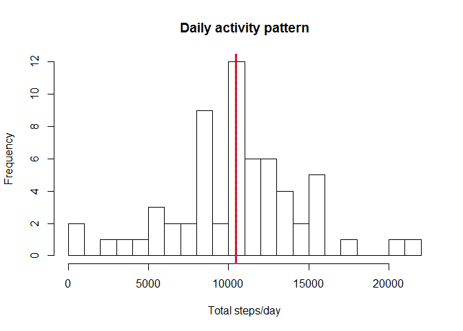

Load and preprocess
-------------------

-   Load and preprocess the data, also here any additional libraries is
    loaded, the activity.csv where the raw data is stored was copied in
    my working directory.

<!-- -->

    library(dplyr)

    ## 
    ## Attaching package: 'dplyr'

    ## The following objects are masked from 'package:stats':
    ## 
    ##     filter, lag

    ## The following objects are masked from 'package:base':
    ## 
    ##     intersect, setdiff, setequal, union

    activityDF <- read.csv("activity.csv")

    #making the date column in a more usable and comfortable format
    activityDF <- activityDF %>% mutate(date = as.POSIXct(date))

Total number of steps taken per day
-----------------------------------

We first calculate the total steps per day, then view the average in a
histogram, the two lines, red and blue, shows mean and median
respectively.

    #group by date and sum the steps to get a total for date
    activityDF_daily <- activityDF %>% group_by(date) %>% summarise(count = sum(steps, na.rm = TRUE), avg = mean(steps, na.rm = TRUE)) %>% arrange(date)

    # draw the histogram
    hist(activityDF_daily$count, breaks = 30, xlab= "Total steps/day", main  = "Daily activity pattern")
    abline(v = mean(activityDF_daily$count, na.rm = TRUE), col = "red", lwd = 3)
    abline(v = median(activityDF_daily$count, na.rm = TRUE), col = "royalBlue", lwd = 1, lty = "dashed")

From the graph of daily number of steps the red vertical line shows
where the mean is wheras the blue dashed line shows the median value on
the graph.

-   Lets calculate the Mean and Median now and print it:

<!-- -->

    #mean
    print(mean(activityDF_daily$count, na.rm = TRUE))

    ## [1] 9354.23

    #medain
    print(median(activityDF_daily$count, na.rm = TRUE))

    ## [1] 10395

Average daily activity pattern
------------------------------

-   The graph below shows the average steps taken per 5 minute interval,
    the red vertical line shows the max interval on average over all
    days in the test set.

<!-- -->

    # First it is necessary to summarise the data according to the intervals
    activityDF_intervals <- activityDF %>% group_by(interval) %>% summarise(cnt = sum(steps, na.rm = TRUE), avg = mean(steps, na.rm = TRUE))

    # now we can plot this:
    plot(x = activityDF_intervals$interval, y = activityDF_intervals$avg, type = "l", xlab = "Interval", ylab = "Steps", main = "Average steps/Interval")
    abline(v = as.numeric(activityDF_intervals[activityDF_intervals$avg == max(activityDF_intervals$avg),1]), col = "red", lty = "dashed")

    #lets get the interval with the highes number of steps in 5 minutes
    print(activityDF_intervals[activityDF_intervals$avg == max(activityDF_intervals$avg),c(1,3)])

    ## Source: local data frame [1 x 2]
    ## 
    ##   interval      avg
    ##      (int)    (dbl)
    ## 1      835 206.1698

The interval 835, as shown in the plot above, has got the most steps on
average across all days for a 5 minute interval at an average of 206
steps.

Imputing missing values
-----------------------

-   I am using the *mice* package here that assists with imputing
    values, make sure you have it installed.

<!-- -->

    library(mice)

    ## Warning: package 'mice' was built under R version 3.2.5

    ## Loading required package: Rcpp

    ## mice 2.25 2015-11-09

    #only use the int columns here for the imputation, also there are no missing values in the dates
    activityDF_sub <- activityDF[,c(1,3)]

    #run the imputing function
    activity_imp <- mice(activityDF_sub, m=2, maxit = 20, method = "pmm", seed = 80)

    ## 
    ##  iter imp variable
    ##   1   1  steps
    ##   1   2  steps
    ##   2   1  steps
    ##   2   2  steps
    ##   3   1  steps
    ##   3   2  steps
    ##   4   1  steps
    ##   4   2  steps
    ##   5   1  steps
    ##   5   2  steps
    ##   6   1  steps
    ##   6   2  steps
    ##   7   1  steps
    ##   7   2  steps
    ##   8   1  steps
    ##   8   2  steps
    ##   9   1  steps
    ##   9   2  steps
    ##   10   1  steps
    ##   10   2  steps
    ##   11   1  steps
    ##   11   2  steps
    ##   12   1  steps
    ##   12   2  steps
    ##   13   1  steps
    ##   13   2  steps
    ##   14   1  steps
    ##   14   2  steps
    ##   15   1  steps
    ##   15   2  steps
    ##   16   1  steps
    ##   16   2  steps
    ##   17   1  steps
    ##   17   2  steps
    ##   18   1  steps
    ##   18   2  steps
    ##   19   1  steps
    ##   19   2  steps
    ##   20   1  steps
    ##   20   2  steps

    activity_imp_done <- complete(activity_imp, 2)
    #add the date variable back:
    activity_imp_done <- cbind(activity_imp_done, activityDF$date)

    names(activity_imp_done)[names(activity_imp_done)=="activityDF$date"] <- "date"

    # re-calculate daily activity patern with amended data
    steps_daily <- activity_imp_done %>% group_by(date) %>% summarise(count = sum(steps, na.rm = TRUE), avg = mean(steps, na.rm = TRUE)) %>% arrange(date)

    #draw a histogram of the results

    hist(steps_daily$count, breaks = 30, xlab= "Total steps/day", main  = "Daily activity pattern")
    abline(v = mean(steps_daily$count, na.rm = TRUE), col = "red", lwd = 3)
    abline(v = median(steps_daily$count, na.rm = TRUE), col = "royalBlue", lwd = 1, lty = "dashed")

    #what is our mean and medians now

    print(mean(steps_daily$count, na.rm = TRUE))

    ## [1] 10458.77

    print(median(steps_daily$count, na.rm = TRUE))

    ## [1] 10439

The median has stayed very much the same, the mean is now slightly
larger, you can also see that the first bar(left most column) in the
non-imputed histogram had a high frequency, the histogram with the
imputed values represents more of a bell curve.

Weekend and Weekday activity paterns.
-------------------------------------

Before we start it is important to note that here I used the *Chron*
package, make sure you have it installed, the version I used can be
found at :
[link](https://cran.rstudio.com/bin/windows/contrib/3.2/chron_2.3-47.zip)

    library(chron)

    ## Warning: package 'chron' was built under R version 3.2.5

    # create an additional column that is true if date is a weekend and false otherwise
    DayType <- activity_imp_done %>% mutate(isWeekend =  is.weekend(date))
    wkends <- filter(DayType, isWeekend)
    wkdays <- filter(DayType, !isWeekend)

    mean_week <- wkends %>% group_by(interval) %>%  summarise(avg=mean(steps))  %>% arrange(interval)
    mean_wdays <-  wkdays %>% group_by(interval) %>%  summarise(avg=mean(steps)) %>% arrange(interval)

    #draw the seperate averages
    par(mfrow =  c(2,1))
    plot(mean_week$interval, mean_week$avg, type = "l",  ylab =  "Steps/5min", xlab = "Interval", main = "Weekends activity",  col  = "firebrick")
    plot(mean_wdays$interval, mean_wdays$avg, type  =  "l", ylab = "Steps/5min", xlab = "Interval",  main  = "Weekdays activity", col = "royalblue")

During the week there is a high spike at around intervals 830 - 900,
whereas the weekends shows a more linear activity patern.
